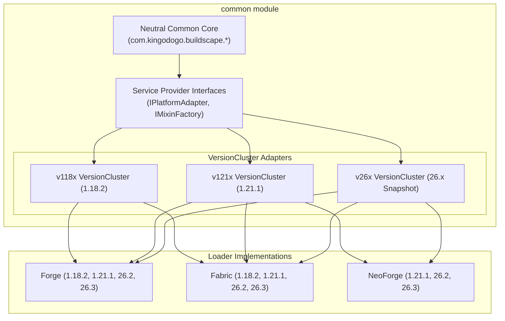

# Buildscape Maintainer Documentation

Welcome to the central documentation hub for the Buildscape codebase. Buildscape is designed with a **VersionCluster Adaptation Architecture** that targets multiple Minecraft versions (1.18.2, 1.21.1, 26.x) across multiple mod loaders (Forge, Fabric, NeoForge) from a single repository.

---

## Documentation Index

- [**Architecture Manual**](ARCHITECTURE.md): Comprehensive guide on the 3-tier VersionCluster architecture, multi-version source sets, and platform abstraction layers.
- [**Development Rules & Standards**](RULES_AND_STANDARDS.md): Invariant engineering rules—No stubs, no copy-paste, neutrality in common, unified mixin rules, and registry safety agreements.
- [**Maintainer Guide: Which Thing Goes Where?**](MAINTAINER_GUIDE.md): Practical feature implementation guide for blocks, items, block entities, entities, recipes, world generation, networking, screens, and mixins.
- [**Build & Test Verification Manual**](BUILD_AND_TEST.md): Commands for multi-VersionCluster compilation, full offline builds, launching clients, diagnostic log inspection, and troubleshooting pitfalls.

---

## High-Level Architecture Overview

